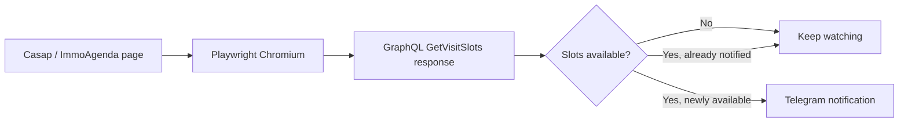

# Casap Visit Watcher

Casap Visit Watcher is a lightweight Playwright worker that monitors property viewing availability and sends a Telegram alert when new visit slots appear.

It opens the public Casap / ImmoAgenda waiting-list page in Chromium, observes the GraphQL response that contains visit-slot availability, and notifies a configured Telegram chat when availability changes from none to one or more slots.

Python · Playwright · GraphQL · Docker · Telegram

## Overview

The worker is intended for personal monitoring of a property that you are interested in. It does not book a viewing and does not call the GraphQL API directly: the public page is loaded in a browser and its generated network response is observed.

## How it works



On each cycle, the worker loads the configured property page and looks for a successful `GetVisitSlots` GraphQL response. It keeps the previous availability state so that Telegram is notified only when slots newly appear. If slots disappear and later return, a new notification is sent.

## Features

- Monitors one Casap property identified by `ESTATE_ID`.
- Uses Playwright and Chromium rather than a direct API client.
- Sends a Telegram message with the number and a preview of available slots.
- Supports a startup Telegram test message with `TEST_NOTIFICATION=true`.
- Uses a randomized polling interval.
- Recovers from repeated page failures with a long backoff and browser restart.
- Restarts after an unrecoverable Playwright/browser failure.
- Runs as a continuous local process or Docker worker.

## Requirements

- Python 3.11 or a compatible Python version supported by the pinned dependencies.
- Chromium installed by Playwright when running outside Docker.
- A Telegram bot token and destination chat ID.
- Access to the public Casap / ImmoAgenda page for the property being monitored.

## Configuration

Provide the following values through the process environment. For Docker, they can be stored in a local `.env` file and passed with `--env-file`; local Python execution requires exporting or setting them in the shell. Never commit real credentials.

```dotenv
TELEGRAM_TOKEN=<telegram-bot-token>
CHAT_ID=<telegram-chat-id>
ESTATE_ID=<casap-property-id>
HEADLESS=true
MIN_SLEEP_SECONDS=22
MAX_SLEEP_SECONDS=38
MAX_CONSECUTIVE_ERRORS=10
LONG_BACKOFF_SECONDS=300
TEST_NOTIFICATION=false
```

| Variable | Required | Default | Description |
| --- | --- | --- | --- |
| `TELEGRAM_TOKEN` | Yes | — | Telegram bot token. |
| `CHAT_ID` | Yes | — | Telegram chat or group ID. |
| `ESTATE_ID` | No | The default ID in `main.py` | Casap property ID to monitor. |
| `HEADLESS` | No | `true` | Set to `false` for local browser debugging. |
| `MIN_SLEEP_SECONDS` | No | `22` | Lower bound of the randomized polling delay. |
| `MAX_SLEEP_SECONDS` | No | `38` | Upper bound of the randomized polling delay. |
| `MAX_CONSECUTIVE_ERRORS` | No | `10` | Consecutive page failures before recovery. |
| `LONG_BACKOFF_SECONDS` | No | `300` | Pause before recreating the browser after repeated failures. |
| `TEST_NOTIFICATION` | No | `false` | Send a Telegram test message at startup. |

To create a bot, use Telegram's `@BotFather`. To find a chat ID, start the bot, send it a message, and inspect the response from Telegram's `getUpdates` endpoint. Treat both the bot token and chat ID as secrets or sensitive configuration.

## Running locally

Create a virtual environment, install the Python dependencies, and install Chromium:

```bash
python -m venv .venv

# macOS / Linux
source .venv/bin/activate

# Windows PowerShell
.\.venv\Scripts\Activate.ps1

pip install -r requirements.txt
playwright install chromium
```

Set the variables from the configuration section, then run:

```bash
python main.py
```

Use `HEADLESS=false` during local debugging if you want to see the browser window. Stop the worker with `Ctrl+C`.

## Running with Docker

The included Dockerfile uses the Playwright Python image, which already contains Chromium and its system dependencies.

Build the image:

```bash
docker build -t casap-visit-watcher .
```

Run it with an environment file containing your local secrets:

```bash
docker run --rm --env-file .env casap-visit-watcher
```

The worker does not expose an HTTP port. Keep the container running as a worker process and inspect its standard output for logs.

## Reliability and error handling

- Page-load timeouts and other loading errors are logged and counted.
- After `MAX_CONSECUTIVE_ERRORS` failures, the worker waits for `LONG_BACKOFF_SECONDS`, closes the current browser context, and creates a fresh browser session.
- If Playwright fails outside the normal page-loading path, the outer loop waits 60 seconds and starts the worker again.
- Telegram is notified only on the transition to available slots, avoiding repeated messages while the same availability remains present.

## Security and secrets

- Keep `.env`, Telegram tokens, and chat identifiers out of version control.
- Do not paste real credentials into documentation, issues, or logs.
- The worker uses the browser session created by the public page and does not require a manually supplied Casap authentication token.
- Use a reasonable polling interval and personal-use scope to avoid unnecessary load on the public service.

## Limitations

- Availability depends on the public Casap / ImmoAgenda page and its current GraphQL response format. Changes to that service may require code updates.
- The worker monitors one property per process and does not reserve a slot automatically.
- Telegram delivery and the public page's availability are external dependencies.
- The default worker is intentionally a continuous polling process; it does not provide a web UI, health endpoint, or historical database.
- A Telegram notification means that availability was observed, not that the slot is still available when the link is opened.

## Notification screenshot

No screenshot is included yet. A Telegram notification screenshot can be added here later if a sanitized example is available; do not commit personal chat details or bot credentials.

## Project files

- `main.py` — worker, browser lifecycle, GraphQL response handling, and Telegram notifications.
- `requirements.txt` — pinned Python dependencies.
- `Dockerfile` — reproducible Playwright/Chromium runtime image.

## License

This project is licensed under the MIT License; see [`LICENSE`](LICENSE).
